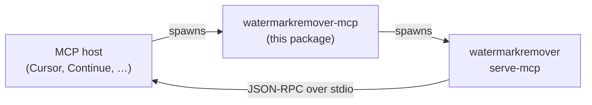

# @watermarkremover/mcp

> npm wrapper for the [WatermarkRemover](https://github.com/techbuzzz/ai-watermark-remover)
> MCP server. Installs the platform-appropriate release binary on
> `npm install`, exposes it as `watermarkremover-mcp` on `$PATH`, and
> spawns `watermarkremover serve-mcp` over stdio — for any MCP host
> that prefers npm-based registration (Cursor, Continue, custom hosts,
> internal tooling).

## What it does



- `npm install @watermarkremover/mcp` downloads the platform-
  appropriate `watermarkremover-<rid>.zip` from the project's
  [GitHub Releases](https://github.com/techbuzzz/ai-watermark-remover/releases),
  extracts the `watermarkremover[.exe]` binary into `./bin/`, and
  makes it `chmod 0755`.
- `npx @watermarkremover/mcp` spawns the binary with `serve-mcp` and
  pipes stdio. **stdout** is the MCP JSON-RPC channel; **stderr**
  carries the server's logs (per the MCP stdio spec).
- No runtime dependencies — pure Node built-ins.

## Install

```bash
# local project
npm install @watermarkremover/mcp

# one-off (no install) — useful for quick smoke tests
npx @watermarkremover/mcp
```

After install, the binary lives at
`node_modules/@watermarkremover/mcp/bin/watermarkremover[.exe]`.
The `watermarkremover-mcp` shim is also added to your `node_modules/.bin/`.

## Wire it up

### Cursor

`~/.cursor/mcp.json`:

```json
{
  "mcpServers": {
    "watermarkremover": {
      "command": "npx",
      "args": ["-y", "@watermarkremover/mcp"]
    }
  }
}
```

### Continue

`~/.continue/config.json` (merge into your existing `mcpServers`):

```json
{
  "mcpServers": [
    {
      "name": "watermarkremover",
      "command": "npx",
      "args": ["-y", "@watermarkremover/mcp"]
    }
  ]
}
```

### Source mode (no download)

Skip the postinstall download and point at a local build:

```bash
export WR_SKIP_BINARY_DOWNLOAD=1
export WATERMARKREMOVER_BINARY="$PWD/src/WatermarkRemover.CLI/bin/Debug/net10.0/watermarkremover"
npm install @watermarkremover/mcp
npx @watermarkremover/mcp
```

`WATERMARKREMOVER_BINARY` may also be a `dotnet run` script:
`"dotnet run --project /path/to/src/WatermarkRemover.CLI --"`.

## How binary resolution works

In priority order:

1. `WATERMARKREMOVER_BINARY` (if it points at an existing file)
2. `<packageDir>/bin/watermarkremover[.exe]` (postinstall target)
3. `watermarkremover` on `$PATH`
4. Unresolved — the wrapper prints a remediation message and exits 127

See [`lib/binary.js`](./lib/binary.js) for the source of truth.

## Postinstall behaviour

- **Skipped** when `WR_SKIP_BINARY_DOWNLOAD=1`.
- **Skipped** when the binary already exists at the install target
  (idempotent re-installs).
- **Forced** when `WR_FORCE_BINARY_DOWNLOAD=1` (re-download even if
  present — useful when a new release comes out and you want to
  upgrade without bumping the package version).
- **Soft-fails** on network errors: postinstall exits 0 and prints a
  remediation message to stderr. npm surfaces a yellow warning but
  your `npm install` still succeeds — you can wire up
  `WATERMARKREMOVER_BINARY` and run the wrapper without ever
  downloading the release artefact.

## Supported RIDs

| `process.platform` | `process.arch` | RID          | Asset                                    |
| ------------------ | -------------- | ------------ | ---------------------------------------- |
| `linux`            | `x64`          | `linux-x64`  | `watermarkremover-linux-x64.zip`         |
| `linux`            | `arm64`        | `linux-arm64`| `watermarkremover-linux-arm64.zip`       |
| `darwin`           | `x64`          | `osx-x64`    | `watermarkremover-osx-x64.zip`           |
| `win32`            | `x64`          | `win-x64`    | `watermarkremover-win-x64.zip`           |

The matrix is kept in sync with
[`.github/workflows/release.yml`](../../.github/workflows/release.yml).
Unsupported platforms (currently `darwin-arm64`, `win32-arm64`,
`freebsd`, etc.) throw a clear error at spawn time — install
`WATERMARKREMOVER_BINARY` pointing at a local build, or grab the
binary directly from the [releases page](https://github.com/techbuzzz/ai-watermark-remover/releases).

## Tests

```bash
npm test
```

The suite uses `node --test` (Node 18+), covers platform detection,
URL shape, binary resolution priority, and the in-tree ZIP extractor.
No network calls, no `node_modules` dependencies.

## License

MIT — same as the parent project.
